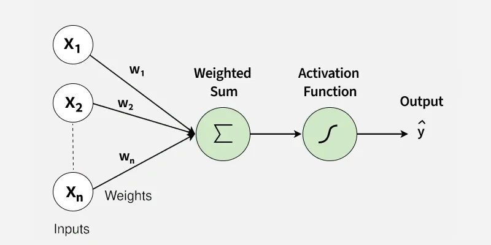
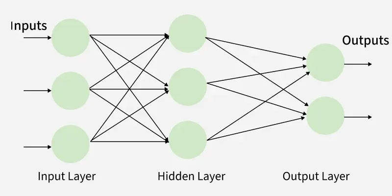
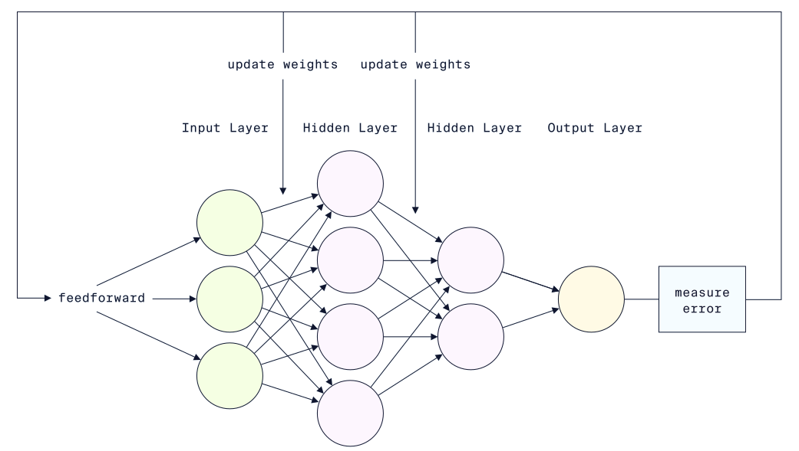

# An Introduction to Neural Networks with PyTorch
*A compact introduction to neural networks and using PyTorch.*

Artificial neural networks are computational models inspired by the biological neural networks in brains, and are one of the most influential computational models used in machine learning. They are used for a variety of tasks such as predictive modeling, natural language processing, and computer vision.

A popular way to implement neural networks is via [PyTorch](https://pytorch.org/), which is an open-source deep learning library originally developed by Meta, and currently developed with support from the Linux Foundation. Competing alternatives include [TensorFlow](https://www.tensorflow.org/) and [JAX](https://jax.dev/).

Supported languages are Python, C++, and Java, but given PyTorch's Pythonic design and integration with native Python tools such as NumPy and pandas, this guide will be for Python.

## Table of Contents

## Local Setup

Get started by following the official [PyTorch installation instructions](https://pytorch.org/get-started/locally/). Using PyTorch is done via:

```python
import torch
```

## Tensors

**Tensors** are multidimensional arrays containing elements of the same data type, and are the fundamental building blocks of neural networks in PyTorch - all input data, output data, and model weights are stored as tensors.
- 1-dimensional tensors are called **vectors**.
- 2-dimensional tensors (which contain arbitrarily many vectors) are called **matrices**.
- n-dimensional tensors, for n ≥ 3, (which contain arbitrarily many (n-1)-dimensional tensors) are simply called tensors.

### Converting Data to Tensors

It is common to be given data as NumPy arrays or pandas DataFrames. To convert these to tensors we can use the `torch.tensor()` method.

```python
data = [100, 54, -41]
data_tensor = torch.tensor(data=data, dtype=torch.int16)
print(data_tensor)  # Print: tensor([100,  54, -41], dtype=torch.int16)
```

### Creating and Initialising Tensors

Tensors can be created in several ways.

If the values within a tensor does not matter, then the `torch.empty()` method can be used to create a tensor filled with uninitialised data, i.e. values already present in the assigned memory block (allocated according to the tensor's shape). If determinism is required, then see [the method's documentation](https://docs.pytorch.org/docs/stable/generated/torch.empty.html).

```python
tensor = torch.empty((2, 3, 2), dtype=torch.int32)
print(tensor)
# Prints: tensor([[[1275134256,       1000],
#                  [         0,          0],
#                  [         0,          0]],
#                  
#                  [[         0,          0],
#                  [         0,          0],
#                  [         0,          0]]], dtype=torch.int32)
```

If the values within a tensor does matter, then use one of the following methods to create a tensor:
- `torch.zeros()`, to fill with all zeroes.
- `torch.ones()`, to fill with all ones.
- `torch.tensor()`, to fill with specified values.
- `torch.rand()`, to fill with random values.

```python
tensor_zeros = torch.zeros((5, 2), dtype=torch.float16)
tensor_ones = torch.ones((3, 4), dtype=torch.uint8)
tensor_specific = torch.tensor([[1, 4, 2.83], [1.002, 0.4, -3]])
tensor_random = torch.rand((4, 7), dtype=torch.complex32)

print(tensor_zeros)
print(tensor_ones)
print(tensor_specific)
print(tensor_random)
# Prints: tensor([[0., 0.],
#                 [0., 0.],
#                 [0., 0.],
#                 [0., 0.],
#                 [0., 0.]], dtype=torch.float16)
#         tensor([[1, 1, 1, 1],
#                 [1, 1, 1, 1],
#                 [1, 1, 1, 1]], dtype=torch.uint8)
#         tensor([[ 1.0000,  4.0000,  2.8300],
#                 [ 1.0020,  0.4000, -3.0000]])
#         tensor([[0.1074+0.9023j, 0.2461+0.7334j, 0.0439+0.7412j, 0.5557+0.0864j,
#                  0.6460+0.8350j, 0.2173+0.9922j, 0.9722+0.8062j],
#                 [0.2715+0.5024j, 0.0850+0.7739j, 0.5542+0.7275j, 0.6240+0.1890j,
#                  0.0400+0.9819j, 0.8984+0.0918j, 0.7617+0.6108j],
#                 [0.5273+0.2871j, 0.5215+0.0137j, 0.8896+0.8486j, 0.1582+0.3774j,
#                  0.3472+0.2290j, 0.5884+0.2231j, 0.0547+0.7910j],
#                 [0.7129+0.6191j, 0.6772+0.2993j, 0.9653+0.9897j, 0.9082+0.3765j,
#                  0.4531+0.9468j, 0.4512+0.1489j, 0.6650+0.5752j]],
#                dtype=torch.complex32)
```

### Altering Datatypes

Tensors are given a datatype upon creation (either by default or explicitly). These can be changed via the `.to()` method.

```python
float_tensor = torch.tensor([100, 54, -41], dtype=torch.float16)
int_tensor = float_tensor.to(dtype=torch.int16)
print(float_tensor)  # Print: tensor([100.,  54., -41.], dtype=torch.float16)
print(int_tensor)  # Print: tensor([100,  54, -41], dtype=torch.int16)
```

### Shapes

Tensor shapes can be accessed via the `.shape` attribute.

```python
tensor = torch.tensor([[1, 4, 2.83], [1.002, 0.4, -3]])
tensor_shape = tensor.shape
print(tensor_shape)  # Print: torch.Size([2, 3])
```

Shapes can be altered, as long as the total number of elements remain constant.

This can be done arbitrarily via the `.reshape()` method.

```python
tensor = torch.rand((2, 3, 2))
tensor_matrix = tensor.reshape((4, 3))
tensor_vector = tensor.reshape((12))

print(tensor.shape)
print(tensor)
print(tensor_matrix.shape)
print(tensor_matrix)
print(tensor_vector.shape)
print(tensor_vector)
# Prints: torch.Size([2, 3, 2])
#         tensor([[[0.4219, 0.0159],
#                  [0.3079, 0.0944],
#                  [0.2078, 0.1408]],
#
#                 [[0.1276, 0.7745],
#                  [0.1160, 0.1393],
#                  [0.4633, 0.2628]]])
#         torch.Size([4, 3])
#         tensor([[0.4219, 0.0159, 0.3079],
#                 [0.0944, 0.2078, 0.1408],
#                 [0.1276, 0.7745, 0.1160],
#                 [0.1393, 0.4633, 0.2628]])
#         torch.Size([12])
#         tensor([0.4219, 0.0159, 0.3079, 0.0944, 0.2078, 0.1408, 0.1276, 0.7745, 0.1160,
#                 0.1393, 0.4633, 0.2628])
```

This can also be done by specifically adding or removing dimensions of size one via the following methods:
- `.unsqueeze()` (or `unsqueeze_()` for in-place), to insert a size one dimension at the specified position.
- `.squeeze()` (or `squeeze_()` for in-place), to remove all size one dimensions (optionally, at a specified position).

```python
tensor = torch.tensor([1, 2, 3, 4])
tensor_unsqueezed_0 = tensor.unsqueeze(0)
tensor_unsqueezed_1 = tensor.unsqueeze(1)

print(tensor.shape)
print(tensor)
print(tensor_unsqueezed_0.shape)
print(tensor_unsqueezed_0)
print(tensor_unsqueezed_1.shape)
print(tensor_unsqueezed_1)
# Prints: torch.Size([4])
#         tensor([1, 2, 3, 4])
#         torch.Size([1, 4])
#         tensor([[1, 2, 3, 4]])
#         torch.Size([4, 1])
#         tensor([[1],
#                 [2],
#                 [3],
#                 [4]])
```

```python
tensor = torch.tensor([[[1], [2], [3], [4]]])
tensor_squeezed_0 = tensor.squeeze(0)
tensor_squeezed_2 = tensor.squeeze(2)
tensor_squeezed = tensor.squeeze()

print(tensor.shape)
print(tensor)
print(tensor_squeezed_0.shape)
print(tensor_squeezed_0)
print(tensor_squeezed_2.shape)
print(tensor_squeezed_2)
print(tensor_squeezed.shape)
print(tensor_squeezed)
# Prints: torch.Size([1, 4, 1])
#         tensor([[[1],
#                  [2],
#                  [3],
#                  [4]]])
#         torch.Size([4, 1])
#         tensor([[1],
#                 [2],
#                 [3],
#                 [4]])
#         torch.Size([1, 4])
#         tensor([[1, 2, 3, 4]])
#         torch.Size([4])
#         tensor([1, 2, 3, 4])
```

## Neural Networks

A **neural network** or **neural net** (NN) is a computational model which consists of connected nodes. Neural networks are inspired by the biological neural networks in brains:
- Edges are meant to model synapses.
- Nodes are meant to model biological neurons, so are called **neurons** or **artificial neurons**.
- Values get sent between neurons, which are meant to model signals, with the strength of signals determined by a **weight**.
- Neurons process the weighted totality of its inputs via a (typically non-linear) function called an **activation function**, which is meant to model biological neuron activation.
- Neurons are typically grouped by layer:
  * The first layer is called the **input layer**, and typically consists of raw inputs with no transformations applied.
  * The final layer is called the **output layer**, and typically produces a raw output with no activation functions applied.
  * Any intermediate layers are called a **hidden layer**.
  * A layer where all neurons connect to all neurons in the previous layer and the following layer are called a **fully connected layer** or a **dense layer**.

Types of neural networks include the following:
- A **deep neural network** is a neural network with at least two hidden layers. Machine learning which utilises deep neural networks is called **deep learning**.
- A **feedforward neural network** is a neural network where values flow in a single direction, from the input layer to the output layer.
- A **recurrent neural network** (RNN) is a neural network where there exists a loop, i.e. a path where the output of a neuron in a layer may be fed back as input to a neuron in a previous layer.
- A **fully connected neural network** (FCNN) or **dense neural network** (DCN) is a neural network where all layers are fully connected.

The [PyTorch neural network library](https://docs.pytorch.org/docs/main/nn.html) provides several building blocks for creating neural networks.

### Weighted Sums

The **weighted sum** processed by neurons is the same as the equation used to represent a multiple linear regression model. For completeness, we describe this here.

A **regression problem** is a problem of predicting an output/target/label, given an unlabeled input example/feature. A regression problem is solved by a **regression learning algorithm**, which produces a model based on a collection of labeled input examples/features.

One of the most basic models is a linear regression model, which use linear equations of the form `y = mx + b`, where:
- `y` is the output/target/label
- `x` is the input example/feature
- `m` is the **weight**
- `b` is the **bias**

This can be extended to a multiple linear regression model, where models can consider more than one input example/feature, where each of these will also have their own weight: `y = m₁x₁ + m₂x₂ + ⋯ + mₙxₙ + b`. More succinctly the model can be written as an affine linear transformation `y = xMᵀ + b`, where x and M are vectors whose elements consist of `xᵢ` and `mᵢ`, respectively.

The affine linear transformation is implemented via `torch.nn.Linear()`. By default, the  weights and biases are learned automatically as the neural network runs, and are pseudorandomly initialised. In general, pseudorandomness can be made deterministic by setting `torch.manual_seed()`.

### Activation Functions

For a given neuron in a neural network, an **activation function** is a function which determines the output of the neuron based on its inputs and their weights. There are several common activation functions in use, with various mathematical properties - some are non-differentiable, some are discontinuous, and some have non-finite ranges. The activation function choice depends on context.

Some common activation functions are:
- ReLU (Rectified Linear Unit), implemented via `torch.nn.ReLU()`, defined by `ReLU(x) = max(0, x)`, and has a range of `[0, ∞)`.
- ReLU6, implemented via `torch.nn.ReLU6()`, defined by `ReLU6(x) = min(max(0, x), 6)`, and has a range of `[0, 6]`. This is a variant of `ReLU` with capping.
- Leaky ReLU, implemented via `torch.nn.LeakyReLU()`, defined by outputting `negative_slope*x` if `x` is negative, and `x` otherwise, and has a range of `(-∞, ∞)`. Intuitively this allows for negative inputs to still have a small gradient, which prevents neurons from dying.
- Sigmoid (also called Logistic), implemented via `torch.nn.Sigmoid()`, defined by `Sigmoid(x) = 1/(1 + exp(-x))`, and has a range of `(0, 1)`.
- Tanh (Hyperbolic Tangent), implemented via `torch.nn.Tanh()`, defined by `Tanh(x) = (exp(x) - exp(-x))/(exp(x) + exp(-x))`, and has a range of `(-1, 1)`.
- Softmax, implemented via `torch.nn.Softmax()`, defined by `Softmax(xᵢ) = exp(xᵢ)/∑_ⱼexp(xⱼ)`, where the `xᵢ` are the elements of an input tensor. Intuitively, this rescales the elements such that they lie in the range `(0, 1]` and sum to `1`, effectively allowing them to be viewed as probabilities.

### Perceptrons

A **perceptron** is the simplest form of a feedforward neural network. It simply combines inputs with weights and a bias to form a weighted sum, then passes the result to an activation function to produce a binary output. A perceptron can also be viewed as a single neuron in a neural network - both perspectives are often used interchangeably.

In the perceptron algorithm, the activation function classically used is a binary step function which outputs `0` if its input is negative, and `1` otherwise. Due to this choice of activation function, perceptrons can only be used on linearly separable data.



### Multilayer Perceptrons

A **multilayer perceptron** (MLP) is a feedforward fully connected neural network with at least one hidden layer (which can each have any number of neurons). These are typically trained using **backpropagation**, an optimization algorithm which, in practice, uses the output of a neural network to update its weights and biases. MLPs improve on perceptrons by being usable on more than just linearly separable data. Each neuron in an MLP can be viewed as a perceptron, but with any choice of activation function.



The training process for an MLP is typically as follows:
1. Feedforward or forward pass: Data flows through the neural network, from input layer to output layer.
2. Loss or error: The neural network's outputs are compared to the actual values to determine the deviation.
3. Backpropagation or backward pass: An optimization algorithm goes back through the neural network to update its weights and biases, with the aim of reducing the loss.
4. Iteration: The above process is repeated, checking each time that the loss or error is decreasing.

<a id="multilayer_perceptron_training"></a>


### Sequential Neural Networks

A **sequential neural network** is a neural network whose layers form a **linear stack** (a single linear chain), so the output of each layer is passed directly as the input to the next, forming a single path through the neural network. There is no **branching** (splitting into multiple paths), **merging** (combining paths), **skip connections** (edges which bypass layers).

Sequential neural networks can be built using the [`torch.nn.Sequential()` class](https://docs.pytorch.org/docs/stable/generated/torch.nn.Sequential.html).

For example, to build the model in [this image](#multilayer_perceptron_training), where the first hidden layer has a ReLU activation function, the second hidden layer has a Sigmoid activation function, and the output layer is just a weighted sum:

<a id="sequential_neural_network_example"></a>
```python
model = torch.nn.Sequential(
    torch.nn.Linear(in_features=3, out_features=4),
    torch.nn.ReLU(),
    torch.nn.Linear(in_features=4, out_features=2),
    torch.nn.Sigmoid(),
    torch.nn.Linear(in_features=2, out_features=1),
)
print(model)
# Prints: Sequential(
#           (0): Linear(in_features=3, out_features=4, bias=True)
#           (1): ReLU()
#           (2): Linear(in_features=4, out_features=2, bias=True)
#           (3): Sigmoid()
#           (4): Linear(in_features=2, out_features=1, bias=True)
#         )
```

Then, running feedforward through the model:

<a id="sequential_neural_network_example_result"></a>
```python
torch.manual_seed(101)

X = torch.tensor([[1, 4, 2.83], [1.002, 0.4, -3]])
feedforward_result = model(X)
print(feedforward_result)
# Prints: tensor([[-1.0445],
#                 [-0.9859]], grad_fn=<AddmmBackward0>)
```

Interpreting this:
- The input feature `[1, 4, 2.83]` corresponds to a label prediction of `-1.0445`.
- The input feature `[1.002, 0.4, -3]` corresponds to a label prediction of `-0.9859`.
- The gradient function used #TODO ???

### Non-Sequential Neural Networks

To create custom neural networks, we should subclass the [`torch.nn.Module` base class](https://docs.pytorch.org/docs/main/generated/torch.nn.Module.html#torch.nn.Module). We can then initialise the layers and activation functions by adding to the base constructor, and the architecture for the feedforward by defining the `forward()` method.

As an example, if we wanted to create a custom neural network which happened to be equivalent to [the previous sequential neural network example](#sequential_neural_network_example), then:

```python
class CustomNeuralNetwork(torch.nn.Module):
    def __init__(self):
        super().__init__()
        
        self.hidden_layer1 = torch.nn.Linear(in_features=3, out_features=4)
        self.hidden_layer2 = torch.nn.Linear(in_features=4, out_features=2)
        self.output_layer = torch.nn.Linear(in_features=2, out_features=1)

        self.relu = torch.nn.ReLU()
        self.sigmoid = torch.nn.Sigmoid()

    def forward(self, X):
        X = self.hidden_layer1(X)
        X = self.relu(X)
        X = self.hidden_layer2(X)
        X = self.sigmoid(X)
        X = self.output_layer(X)
        return X


model_custom = CustomNeuralNetwork()
print(model_custom)
# Prints: CustomNeuralNetwork(
#           (hidden_layer1): Linear(in_features=3, out_features=4, bias=True)
#           (hidden_layer2): Linear(in_features=4, out_features=2, bias=True)
#           (output_layer): Linear(in_features=2, out_features=1, bias=True)
#           (relu): ReLU()
#           (sigmoid): Sigmoid()
#         )
```

Then, running feedforward through the model gives [the exact same result as the previous sequential neural network example](#sequential_neural_network_example_result):

```python
torch.manual_seed(101)

X = torch.tensor([[1, 4, 2.83], [1.002, 0.4, -3]])
feedforward_result_custom = model_custom(X)
print(feedforward_result_custom)
# Prints: tensor([[-1.0445],
#                 [-0.9859]], grad_fn=<AddmmBackward0>)
```
